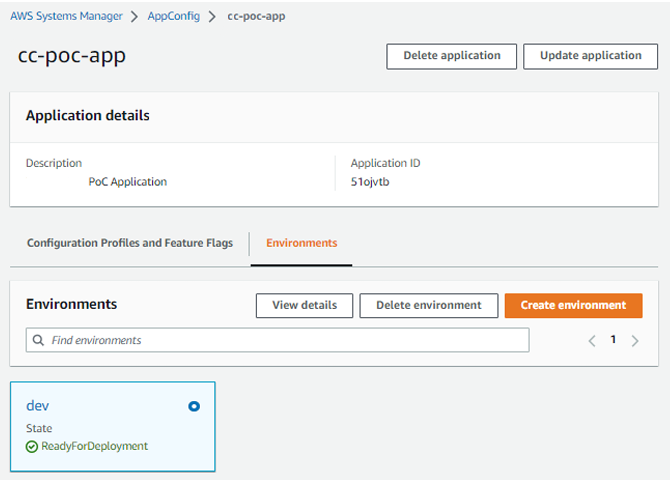

# featureflags-awsappconfig
A walkthrough describing ...


todo - change int refs to cc

######################################################

## Feature Flags with AWS AppConfig  


TOC  


 ### Overview
 
This walk-through describes how to implement and configure feature flags in a stand alone Spring Boot application backed by AWS AppConfig. The application has been deployed to AWS ECS (todo: link to guide).
The accompanying source code for this guide...

| **Repo** | **Description** |
|----------------|-----------------|
| [Sample Application Code](impl/)  | Implementation code necessary for a Spring Boot application to interact with AWS AppConfig.  |
| [Infrastructure as Code](infra/)  | Configurations for defining the necessary infrastructure required for a feature flag implementation using AWS AppConfig. Resources include AppConfig’s application, environments, configuration profiles, extension associations and IAM permissions.   | 
 
### About Feature Flags
 
_(aka Feature Toggles, Feature Flippers, Feature Switch, Feature Controls, Feature Bits, Release Toggles, Conditional Features)_  
  
A feature flag is used to enable or disable functionality without deploying code. New features can be deployed without making them visible to 
users. Feature flags help decouple deployment from release.
  
Feature toggles can be [categorized](https://martinfowler.com/articles/feature-toggles.html#CategoriesOfToggles) as


**Release toggles** - These toggles are used to hide incomplete features from groups of users or from all users.  
**Experiment toggles** - This type is used for A/B testing.  
**Ops toggles** - These toggles are used to control the operational aspects of a system.  
**Permissioning toggles** - This type is used to manage what features are available for different groups of users (e.g., premium users).  


### Infrastructure Setup
- To configure AWS AppConfig to work with your application, you set up three types of resources
  - **Application** - an organizational construct like a folder
  - **Environment** - a logical deployment group of an AppConfig application… e.g. `dev` or `preprod`. You can configure Amazon CloudWatch 
alarms for each environment. The system monitors alarms during a configuration deployment. If an alarm is triggered, the system rolls 
back the configuration.
  - **Configuration profile** - a set of configurations or feature flags. There are 2 types…
    - _**Feature Flags**_ - A predefined format for defining feature flags. Configs are store in AppConfig storage. Validated against a predefined 
schema.
    - _**Freeform**_ - Create configurations in YAML, JSON or text. Can be stored in S3, Systems Manager or Parameter Store. Validator need to be configured manually.
- For this [example](infra/appconfig.tf) we defined the following resources:
  - 1 application
  - 1 environment (dev)
  - 2 configuration profiles (sandbox & live)
- To allow the application running in ECS to listen for SQS messages and retrieve AppConfig data the following IAM policy was added to the services ECS task role.

```json
{
  "Version": "2012-10-17",
  "Statement": [
    {
      "Effect": "Allow",
      "Action": [
        "appconfig:GetLatestConfiguration",
        "appconfig:StartConfigurationSession",
        "sqs:GetQueueUrl",
        "sqs:DeleteMessage",
        "sqs:ReceiveMessage",
        "sqs:GetQueueAttributes"
      ],
      "Resource": "*"
    }
  ]
}
```

To allow AppConfig deployment rollbacks triggered by CloudWatch alarms, configure the following [IAM roles and policy](infra/iam.tf#L38-L75)

```hcl
resource "aws_iam_policy" "cc_poc_rollback" {
  name        = "cc-poc-rollback-policy"  
  policy = jsonencode({
    Version = "2012-10-17"
    Statement = [
      {
        Action = ["cloudwatch:DescribeAlarms"]
        Effect   = "Allow"
        Resource = "*"
      },
    ]
  })
}  

resource "aws_iam_role" "cc_poc_rollback" {
  name = "cc-poc-rollback-role"
  assume_role_policy = jsonencode({
    Version = "2012-10-17"
    Statement = [
      {
        Action = "sts:AssumeRole"
        Effect = "Allow"
        Sid    = ""
        Principal = {
          Service = "appconfig.amazonaws.com"
        }
      },
    ]
  })
}  

resource "aws_iam_role_policy_attachment" "cc_poc_rollback" {
  policy_arn = aws_iam_policy.cc_poc_rollback.arn
  role       = aws_iam_role.cc_poc_rollback.name
}
```


- When deployed check the [AppConfig console](https://eu-central-1.console.aws.amazon.com/systems-manager/appconfig/?region=eu-central-1)  

|  |  |  |
|--------------------------------------|------------------------------------------|------------------------------------------|
| **Config Profiles & Feature Flags**                          | **Environments**                            | **Flags**                            |


## How AppConfig works in your application

### Vanilla behavior
The application set up an client side AppConfig session and intermittently polls for updates to feature flag data. When the
- response returns data, the server side data has been updated and your app should reflect that
- response is empty, you already have the latest data

### AppConfig integrated with AWS messaging

> :information_source: **Info:** AWS AppConfig has [extension](https://docs.aws.amazon.com/appconfig/latest/userguide/working-with-appconfig-extensions-about-predefined.html) functionality that can help you integrate the AWS AppConfig workflow with other internal AWS services such as [SQS](https://docs.aws.amazon.com/appconfig/latest/userguide/working-with-appconfig-extensions-about-predefined-notification-sqs.html) & [SNS](https://docs.aws.amazon.com/appconfig/latest/userguide/working-with-appconfig-extensions-about-predefined-notification-sns.html), and also external services such as [Jira](https://aws.amazon.com/blogs/mt/tracking-feature-flags-in-jira-with-aws-appconfig/).


<!-- > ⚠️ **Warning:** This is a warning alert box. Be careful!

> ✅ **Success:** The operation was completed successfully.


> :information_source: **Info:** This is an informational alert box.

> :warning: **Warning:** This is a warning alert box. Be careful!

> :white_check_mark: **Success:** The operation was completed successfully.

> :x: **Error:** Something went wrong. Please try again. -->


The AWS AppConfig [configuration](infra/appconfig-sqs.tf) in the example code has been integrated with the SQS [extension](https://docs.aws.amazon.com/appconfig/latest/userguide/working-with-appconfig-extensions-about-predefined-notification-sqs.html) and will send messages to the `cc-poc-appconfig` SQS queue for the following AppConfig action points…


- `ON_DEPLOYMENT_START`
- `ON_DEPLOYMENT_STEP`
- `ON_DEPLOYMENT_BAKING`
- `ON_DEPLOYMENT_COMPLETE`
- `ON_DEPLOYMENT_ROLLED_BACK`


The application must then request the latest data from AppConfig.

> :warning: **Note:** Although AppConfig can integrate with AWS messaging, the vanilla polling rules must still be followed. This is the client application behavior:
> - Event is detected in application
> - Application starts asynchronous polling session
> - Application polls until no data is returned in the response
> - Polling ends  
>If an event arrives while polling is in progress the current polling session is cancelled and a new one is started.


## Application Configuration
The example code in this guide adds Feature Flag functionality to a sample client.  
The following libraries were used…

| **Dependency** | **Maven Library** | **Description** |
|----------------|-----------------|------------------|
| [AppConfigData](https://sdk.amazonaws.com/java/api/latest/software/amazon/awssdk/services/appconfigdata/package-summary.html)  | `appconfigdata`   | The AWS Java SDK for App Config Data module holds the client classes that are used for communicating with App Config Data.   **Note:** This package is from the [AWS SDK v2](https://github.com/aws/aws-sdk-java-v2) which amazon  recommend is used going forward… i.e. do not use older v1 libs  |
| [Spring Cloud for AWS Messaging Starter](https://www.baeldung.com/spring-cloud-aws-messaging)  | `spring-cloud-starter-aws-messaging`   | AWS SQS (Simple Queue Service) & SNS (Simple Notification Service) messaging support  |
| [Jackson Databind](https://github.com/FasterXML/jackson-databind)  | `jackson-databind`   | General-purpose data-binding functionality  |


The implementation consists of...

- a [listener](impl/AppConfigListener.java#L27) that listens for SQS events associated with the AppConfig configuration
  > :information_source: **Info:** If  multiple task/container instances are required the a SNS AppConfig extension integration should be used.
- a [service](impl/AppConfigRequestService.java#L26) that can retrieve App Config Data
- a [service](impl/AppConfigsService.java) that stores feature flag state in memory
- properties in `application.yml`

```yml
awsappconfig:
  appId: *******
  envId: *******
  configProfileId: *******
  region: eu-central-1
  sqs-queue-name: cc-poc-appconfig
```

### Example Feature Flags

The example code has these flags...


Key/Name
logLevels
newFeature
newPersonFeature
badFeature
Implementation Strategies
Description
When true will 
override
values are validated by AppConfig)
the default log level. Can set the level to 
, 
INFO WARN DEBUG
or 
Showcases various implementation strategies for switching behavior:
Conditional
Replace Method
Replace Bean
Replace Module
more details below
When true will 
add a new field
associated list of clients
When enabled 
to a Person model, if the target person is a member the 
throws errors
) will cause AppConfig to rollback the configuration deployment.
(these 
to the logs. When deployed with certain deployment strategies (e.g. 
AllAtOnce
There are some recommended guidelines to help feature flag functionality in the codebase from becoming messy or turning into technical debt.
De-Couple decision points from the feature flag logic - in the example code feature flag state is 
Inversion of control - further decouple modules from the feature flagging system using 
Minimize conditionals - keep the codebase maintainable by avoiding directly adding 
IoC
.
if-else
updated independently
from decision points
statement blocks to code. Especially if a feature 
is long lived or requires several toggles
Toggles at the edge
Placing toggles points in the UI or controllers are appropriate when
An 
you want to show or hide UI elements
the toggle requires a per-request context
the toggle requires a per-user context
advantage
of placing toggle points at the edge is that it keeps fiddley conditional logic out of the core of the system.
Toggles in the core
Some examples of lower level toggles…
Conditional
In some very simple cases maybe a simple 
conditional block
is appropriate
...
@Autowired
private AppConfigsService appConfigsService;
public String doSomething() {
if (appConfigsService.getAppConfigs().getNewFeature().isEnabled()) {
    return "New Implementation";
} else {
    return "Default Implementation";
}
}
...
Replace Method
To replace functionality on the method level we can introduce an interface for the target method(s), then implement a “
proxy
between two (or more) implementations of that interface
” bean that switches 
...
@Autowired
private AppConfigsService appConfigsService;
@Qualifier("replaceMethodNewService")
@Autowired
private NewService newService;
@Qualifier("replaceMethodDefaultService")
@Autowired
private DefaultService defaultService;
Replace Bean
Bean
@Override
public String doSomething() {
if (appConfigsService.getAppConfigs().getNewFeature().isEnabled()) {
    return newService.doSomething();
} else {
    return defaultService.doSomething();
}
}
...
To replace a whole bean based on a feature flag we can leverage Springs  
FactoryBean interface
method is required by another bean in the application context, Spring will ask the 
FactoryBean
. Each time a bean defined using the 
for that bean.
@Component("replaceBeanFeatureFlaggedService")
public class FeatureFlaggedService extends 
FeatureFlagFactoryBean<Service> {
Factory
public FeatureFlaggedService(AppConfigsService appConfigsService) {
        super(
        Service.class,
        () -> appConfigsService.getAppConfigs().getNewFeature().
isEnabled(),
        new NewService(),
        new DefaultService()
    );
}
}
Replace Module
The  
FactoryBean interface
can be used to replace a set of beans also
@Configuration
public class FeatureFlaggedServiceModule {
@Autowired
private AppConfigsService appConfigsService;
@Bean("replaceModuleService1")
FeatureFlagFactoryBean<Service1> service1() {
    return new FeatureFlagFactoryBean<>(
            Service1.class,
            () -> appConfigsService.getAppConfigs().getNewFeature().
isEnabled(),
            new NewService1(),
            new DefaultService1());
}
@Bean("replaceModuleService2")
FeatureFlagFactoryBean<Service2> service2() {
    return new FeatureFlagFactoryBean<>(
            Service2.class,
            () -> appConfigsService.getAppConfigs().getNewFeature().
isEnabled(),
            new NewService2(),
            new DefaultService2());
}
...
Considerations
keep toggle logic simple, don't cascade multiple feature flags
lifecycle and cleanup should be part of the process
feature flags will add complexity to testing/automation
who deploys? In other WH teams it is the CSMs responsibility
AppConfig instances?
maybe a spring boot starter for App Config Data connectivity?
References
https://martinfowler.com/articles/feature-toggles.html
https://launchdarkly.com/blog/what-are-feature-flags/
https://reflectoring.io/spring-boot-feature-flags/
https://mng.workshop.aws/appconfig/cloudwatch-alarm.html
https://aws.amazon.com/blogs/mt/best-practices-for-validating-aws-appconfig-feature-flags-and-configuration-data/
https://launchdarkly.com/blog/operational-flags-best-practices/
https://aws.amazon.com/blogs/mt/tracking-feature-flags-in-jira-with-aws-appconfig
